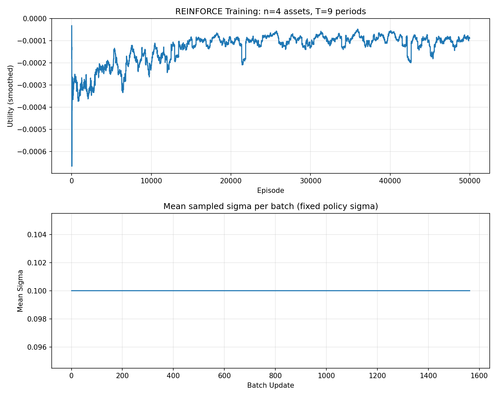
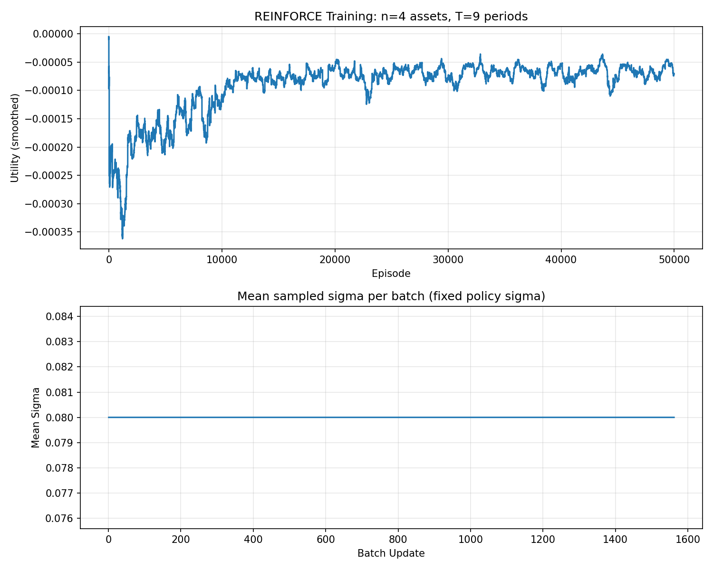
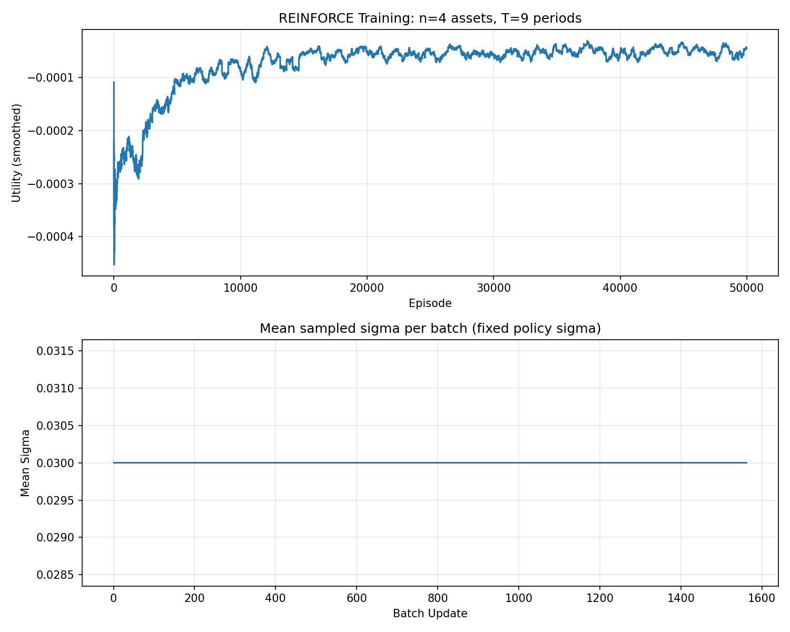
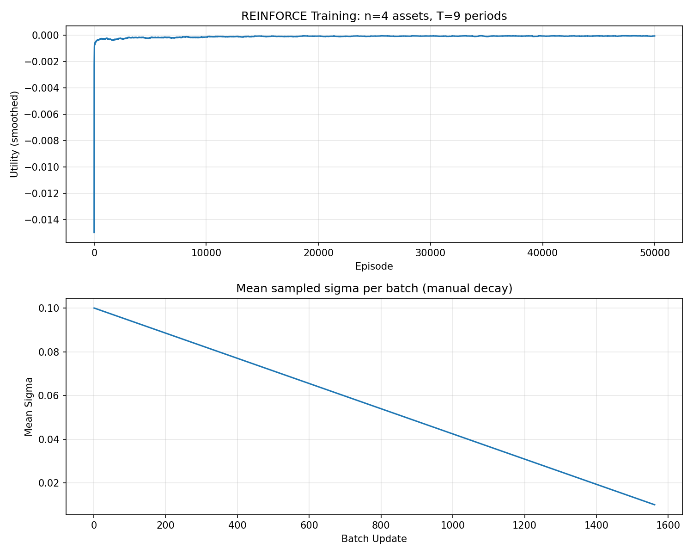
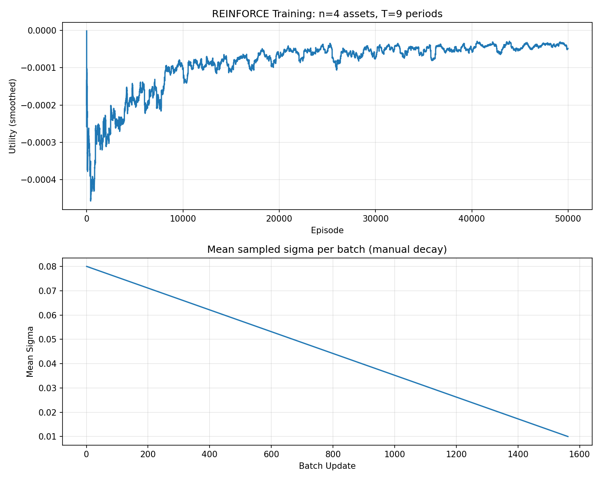
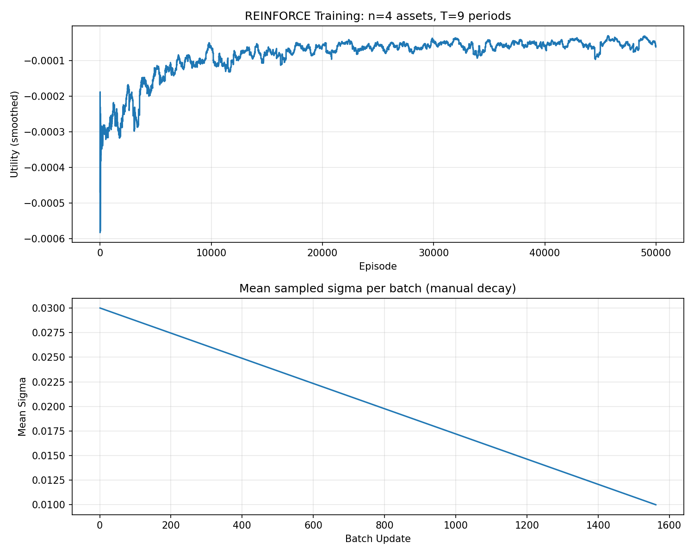
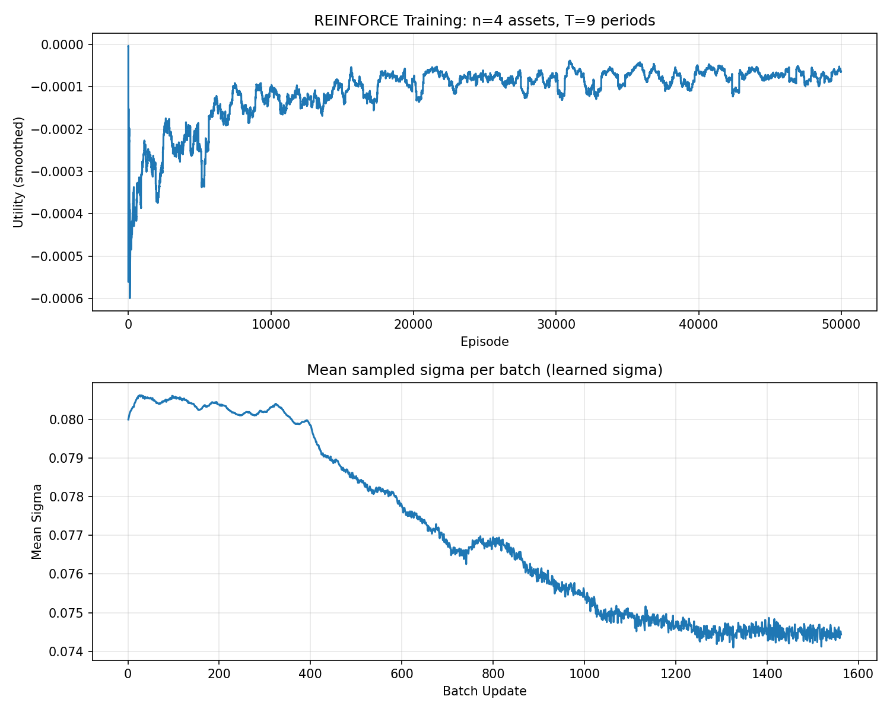
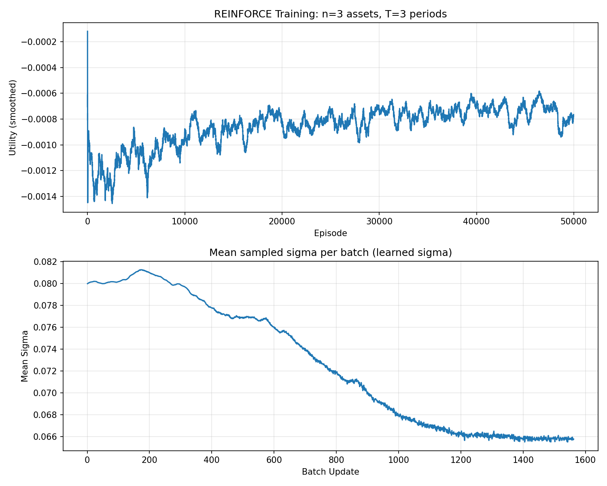
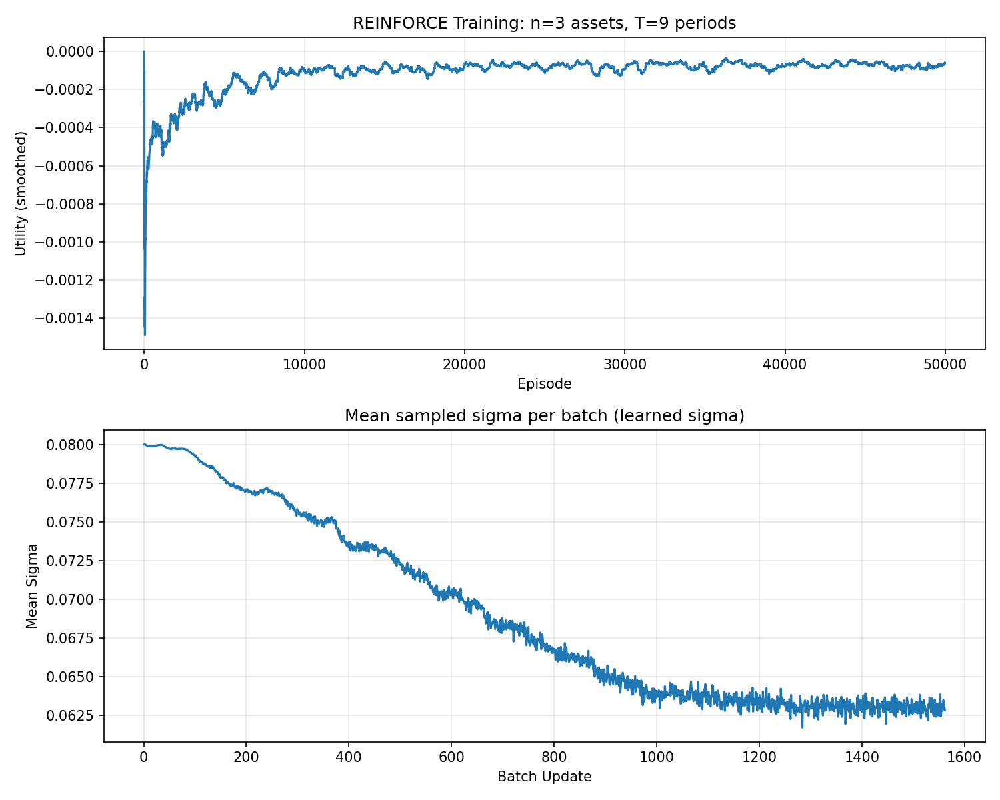
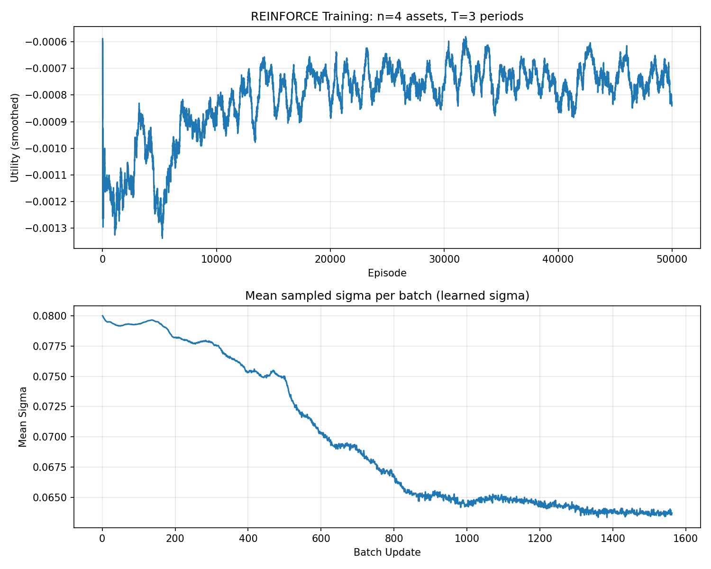

# MSBD5021 Assignment 1: Multi-Asset Allocation with REINFORCE

This project implements a REINFORCE (Monte-Carlo Policy Gradient) algorithm for discrete-time multi-asset portfolio allocation, extending Section 8.4 of *Foundations of Reinforcement Learning with Applications in Finance* (Rao & Jelvis) to **n risky assets + cash** with a **10% rebalancing constraint** and **CARA utility**.

## Problem Formulation

### MDP Definition

| Component | Description |
|-----------|-------------|
| **State** | $(t/T,\; W_t,\; p_0,\; p_1,\; \dots,\; p_n)$ — normalized time, wealth, and current portfolio proportions |
| **Action** | $(\Delta p_1,\; \dots,\; \Delta p_n)$ — adjustments to risky asset proportions |
| **Constraint** | $\|\Delta p_k\| \le 0.1$ for all $k$ (including cash) |
| **Transition** | $W_{t+1} = W_t \sum_k p'_k (1 + Y_k)$, where $Y_k \sim \mathcal{N}(\mu_k, \sigma_k^2)$ for risky assets and $Y_0 = r$ for cash |
| **Reward** | $0$ for $t < T$; $\;U(W_T) = -\frac{1}{a} e^{-a W_T}$ at terminal |

### Key Features

- **n risky assets** ($2 < n < 5$) plus a riskless cash asset
- **CARA utility** with constant absolute risk aversion coefficient $a$
- **10% max portfolio adjustment** per period — no analytical solution, requiring RL
- Works for **any time horizon** $T < 10$

## Algorithm Overview

The core algorithm is a mini-batch REINFORCE with a running mean baseline ($\beta = 0.99$):

- Policy: neural network outputs action mean $\mu$; sigma ($\sigma$) can be:
  - **learned** (state-dependent, final algorithm)
  - **manual decay** (linearly decayed, for ablation)
  - **fixed** (constant, for ablation)
- Network: 2-layer MLP (64 hidden units, ReLU activations, Tanh output scaled by `max_adjustment`)
- Optimizer: Adam ($\text{lr} = 3 \times 10^{-4}$) with cosine annealing LR schedule
- Mini-batch: 32 trajectories per gradient update
- Discount factor: $\gamma = 1$ (only terminal reward)

### REINFORCE Algorithm

This project uses the REINFORCE (Monte-Carlo Policy Gradient) algorithm for policy optimization. REINFORCE is an on-policy policy gradient method that estimates the policy gradient by sampling complete trajectories and using the episodic return as an unbiased gradient estimator, directly optimizing a parameterized policy.

Since this problem only has a non-zero reward at the terminal time step \(t = T\) (the CARA utility) and the discount factor is \(\gamma = 1\), the return of each trajectory is simply the terminal reward itself:

$$
G = R_T = -\frac{1}{a} e^{-a W_T}
$$

The policy gradient theorem gives the following gradient estimate with respect to the policy parameters \(\theta\):

$$
\nabla_\theta J(\theta) = \mathbb{E}_{\pi_\theta} \left[ \sum_{t=0}^{T-1} \nabla_\theta \log \pi_\theta(a_t | s_t) \cdot G \right]
$$

To reduce variance, a baseline \(b\) is introduced, replacing \(G\) with the advantage \(G - b\). This does not change the expected gradient but significantly reduces variance. The baseline is maintained as an exponential moving average:

$$
b \leftarrow 0.99 \cdot b + 0.01 \cdot \bar{G}_{\text{batch}}
$$

where \(\bar{G}_{\text{batch}}\) is the mean return over the current mini-batch.

In practice, each gradient update samples a mini-batch of \(B = 32\) complete trajectories. The loss function is:

$$
\mathcal{L}(\theta) = -\frac{1}{B} \sum_{i=1}^{B} \sum_{t=0}^{T-1} \log \pi_\theta(a_t^{(i)} | s_t^{(i)}) \cdot (G^{(i)} - b)
$$

The Adam optimizer (learning rate \(\text{lr} = 3 \times 10^{-4}\)) is used to perform gradient descent on \(\mathcal{L}\), combined with a Cosine Annealing learning rate scheduler that smoothly decays the learning rate from its initial value down to \(0.01 \times \text{lr}\).

### Policy Network Architecture

The policy network \(\pi_\theta\) maps the current state \(s \in \mathbb{R}^d\) (where \(d = 2 + n + 1\), comprising the normalized time \(t/T\), current wealth \(W_t\), and all asset proportions \(p_0, p_1, \dots, p_n\)) to the parameters of a multivariate Gaussian distribution: the action mean \(\mu \in \mathbb{R}^n\) and standard deviation \(\sigma \in \mathbb{R}^n\).

The feature extraction backbone is a two-layer MLP with hidden dimension 64:

$$
h_1 = \mathrm{ReLU}(W_1 s + b_1), \quad h_2 = \mathrm{ReLU}(W_2 h_1 + b_2)
$$

The action mean is produced by a linear layer followed by a Tanh activation, scaled by the maximum adjustment magnitude \(\delta_{\max}\):

$$
\mu = \tanh(W_\mu h_2 + b_\mu) \times \delta_{\max}
$$

Since Tanh outputs values in \((-1, 1)\), each component of \(\mu\) is inherently bounded within \((-\delta_{\max},\; \delta_{\max})\), providing a soft constraint that ensures the network's mean output does not exceed the allowed maximum adjustment.

For the action standard deviation \(\sigma\), the project supports three strategies. The final algorithm uses **learned sigma** (network-adaptive), produced by a separate linear head and mapped through a sigmoid into a predefined range \([\sigma_{\min},\; \sigma_{\max}]\):

$$
\sigma = \sigma_{\min} + (\sigma_{\max} - \sigma_{\min}) \cdot \text{sigmoid}(W_\sigma h_2 + b_\sigma)
$$

The final policy distribution is a multivariate Gaussian with diagonal covariance:

$$
\pi_\theta(a | s) = \mathcal{N}(a;\; \mu,\; \mathrm{diag}(\sigma^2))
$$

During training, actions are sampled from this distribution \(a \sim \pi_\theta(\cdot|s)\) to enable exploration. During evaluation, the mean \(a = \mu\) is used directly as a deterministic policy.

### Constraint Implementation

The problem requires that portfolio adjustments at each time step satisfy \(|\Delta p_k| \le \delta_{\max} = 0.1\) for all assets \(k\), including cash. Since the action space only outputs adjustments for the \(n\) risky assets \((\Delta p_1, \dots, \Delta p_n)\), the cash adjustment is implicitly determined by the budget constraint as \(\Delta p_0 = -\sum_{k=1}^n \Delta p_k\). The constraints are enforced in three steps within the environment.

**Step 1: Clip risky asset adjustments.** The raw action sampled from the policy network is clipped component-wise to the allowed range:

$$
\Delta p_k \leftarrow \mathrm{clip}(\Delta p_k,\; -\delta_{\max},\; \delta_{\max}), \quad k = 1, \dots, n
$$

**Step 2: Rescale to satisfy the cash constraint.** The implied cash adjustment \(\Delta p_0 = -\sum_{k=1}^n \Delta p_k\) is computed. If \(|\Delta p_0| > \delta_{\max}\), all risky asset adjustments are proportionally rescaled:

$$
\Delta p_k \leftarrow \Delta p_k \times \frac{\delta_{\max}}{|\Delta p_0|}, \quad k = 1, \dots, n
$$

This ensures that after rescaling, \(|\Delta p_0| = \delta_{\max}\), while all risky asset adjustments also remain within \(\delta_{\max}\) (since the scaling factor is less than 1).

**Step 3: Non-negativity and renormalization.** The updated proportion vector \(p' = p + \Delta p\) is truncated to be non-negative and renormalized to sum to 1:

$$
p'_k \leftarrow \max(p'_k,\; 0), \quad p'_k \leftarrow \frac{p'_k}{\sum_j p'_j}
$$

Through these three steps, the environment enforces all constraints when executing actions, allowing the policy network to output freely in continuous action space while a projection mechanism on the environment side maps actions into the feasible region.


## Policy Sigma Strategies: Comparison


| Sigma Type | Description | Advantages | Limitations / Use Cases |
|------------|-------------|------------|------------------------|
| **learn**  | Policy network outputs state-dependent $\sigma$; adaptively balances exploration and exploitation during training | Best performance, dynamically adjusts exploration/exploitation, suitable for real deployment | Slightly higher training complexity, may require more tuning |
| **manual** | $\sigma$ decays linearly with training progress | Simple to implement, suitable for initial experiments and ablation | Cannot adapt exploration to state, may be suboptimal in later training |
| **fixed**  | $\sigma$ remains constant throughout training | Simplest, good for sanity checks and as a baseline | Rigid exploration/exploitation trade-off, limited performance |

This project uses **learn** as the final algorithm. **manual** and **fixed** are provided for ablation and baseline comparison only.

## Project Structure

```
Assignment1_v3/
├── asset_alloc.py        # Main implementation
├── configs/              # JSON config files for all (n, T) combinations
│   ├── n3_T1.json        #   n=3 risky assets, T=1..9
│   ├── ...
│   └── n4_T9.json
├── scripts/
│   ├── run_all_config.sh         # Run all (n, T) configs to show generality
│   └── compare_sigma_types.sh    # Compare fixed/manual/learn sigma on a single config
├── figs/            
│   └── curve_n4_T9.png  # Case study example
├── results/             # Output training curves
├── pyproject.toml       # Project dependencies
└── README.md
```

## Setup

Requires [uv](https://docs.astral.sh/uv/) and Python ≥ 3.14.

```bash
cd Assignment1_v3
uv sync
```

## Usage

### Run a single configuration

```bash
uv run python asset_alloc.py configs/n4_T9.json -o results/curve_n4_T9.png
```


### Run all (n, T) configurations

Demonstrate that the algorithm generalizes to any valid $n$ and $T$:

```bash
bash scripts/run_all_config.sh
```

This runs all combinations of $n \in \{3, 4\}$ and $T \in \{1, 2, \dots, 9\}$.

### Compare sigma strategies (ablation)

Compare the three sigma strategies (fixed/manual/learn):

```bash
bash scripts/compare_sigma_types.sh
```


## Config File Format

Each JSON config specifies the problem parameters:

```json
{
  "n_risky": 4,
  "means": [0.15, 0.05, 0.08, 0.20],
  "variances": [0.04, 0.09, 0.01, 0.16],
  "r": 0.07,
  "a": 5.0,
  "T": 5,
  "init_wealth": 1.0,
  "init_proportions": [0.1, 0.1, 0.6, 0.1, 0.1],
  "max_adjustment": 0.1,
  "num_episodes": 50000,
  "batch_size": 32,
  "print_every": 4000
}
```

| Parameter | Description |
|-----------|-------------|
| `n_risky` | Number of risky assets |
| `means` | Expected returns $\mu_k$ for each risky asset |
| `variances` | Return variances $\sigma_k^2$ for each risky asset |
| `r` | Riskless interest rate |
| `a` | CARA risk aversion coefficient |
| `T` | Investment time horizon (number of periods) |
| `init_wealth` | Initial wealth $W_0$ |
| `init_proportions` | Initial portfolio proportions $[p_0, p_1, \dots, p_n]$ (sum = 1) |
| `max_adjustment` | Maximum allowed proportion change per period |
| `num_episodes` | Number of training episodes |
| `batch_size` | Trajectories per gradient update (default: 32) |
| `print_every` | Print training progress every N episodes |

## Parameter Design

The configs are designed to demonstrate meaningful strategy learning:

**n=3 assets:**

| Asset | $\mu_k$ | $\sigma_k^2$ | Characteristic |
|-------|---------|-------------|----------------|
| Asset1 | 0.15 | 0.04 | High return, low risk |
| Asset2 | 0.05 | 0.09 | $\mu < r$, high risk — should avoid |
| Asset3 | 0.20 | 0.16 | Highest return, very high risk |

**n=4 assets:** adds Asset3 ($\mu=0.08 \approx r$, $\sigma^2=0.01$, cash-like)

**Key design choices:**
- $a = 5.0$ (high risk aversion) — agent must balance return vs. risk, not just maximize return
- Initial proportions **deliberately suboptimal** (60% in a poor asset) — agent must learn to rebalance under the 10% constraint
- Some assets have $\mu_k < r$ — agent must learn to **avoid** bad assets

## Output

The program prints:

1. **Training progress** — average utility every `print_every` episodes
2. **Evaluation table** — mean portfolio proportions and actions at each time step (deterministic policy)
3. **Terminal statistics** — average terminal wealth and utility
4. **Training figure** — saved as a PNG file, showing both the smoothed utility curve and the mean sampled policy sigma for each batch update


## Case Study: Ablation Study on Sigma Strategies and Environment Settings

We conduct a systematic ablation study across **4 environment configurations** (`n3_T3`, `n3_T9`, `n4_T3`, `n4_T9`) and **3 sigma strategies** with multiple parameter settings — **7 runs per config, 28 runs in total** — to compare the effect of sigma type, sigma value, and problem difficulty on training convergence and final policy quality.

Each figure contains two panels:
- **Upper panel**: smoothed CARA utility $U(W_T) = -\frac{1}{a}e^{-a W_T}$ over episodes (higher / less negative is better).
- **Lower panel**: mean sampled policy sigma per batch update, revealing how exploration evolves.

From an RL perspective, sigma is the direct control knob for the **exploration-exploitation trade-off** in REINFORCE. The policy samples actions from a Gaussian distribution $a \sim \mathcal{N}(\mu, \sigma^2)$:
- A **larger sigma** spreads probability mass farther away from the mean action, so the agent explores more aggressively.
- A **smaller sigma** concentrates samples near the mean action, so the agent exploits its current best guess more consistently.
- Therefore, the utility curve and the sigma curve should be read together: when sigma remains large, optimization keeps searching broadly but suffers higher variance; when sigma shrinks, the policy commits to a narrower set of actions and training becomes more stable.

---

### 1. Sigma Strategy Comparison (横向对比: n=4, T=9)

We use `configs/n4_T9.json` as the primary benchmark — the most challenging setting (4 risky assets, 9 time periods, risk aversion $a=5$, 60% initial weight in a suboptimal asset).

#### 1.1 Fixed Sigma

With a fixed constant sigma, the exploration level never changes throughout training.

| sigma | Figure |
|-------|--------|
| 0.10  |  |
| 0.08  |  |
| 0.03  |  |

**Observations:**

- All three fixed sigma values ultimately converge to a similar terminal utility level (~$-1\times10^{-4}$), but with markedly different training dynamics.
- **sigma = 0.10**: This is the most exploration-heavy fixed policy. The sigma panel shows a perfectly flat line at 0.10, meaning the agent keeps injecting large action noise even late in training. The result is persistent utility oscillation: the policy keeps exploring when it should already be exploiting.
- **sigma = 0.08**: A more balanced explore-exploit trade-off. Exploration is still strong enough to search the action space, but exploitation becomes more visible because the sampled actions remain closer to the learned mean. The curve stabilizes around episode 15,000.
- **sigma = 0.03**: This is the most exploitation-heavy fixed policy. Since sampled actions stay close to the current mean action, policy-gradient variance is lower and convergence is faster. The downside is weaker early exploration: if the initial mean policy were poor, this setting would be more likely to commit too early.

**RL interpretation**: Fixed sigma uses a **static exploration budget**. This is easy to implement, but fundamentally mismatched to learning dynamics: early training typically needs more exploration, while late training benefits from more exploitation. A constant sigma cannot respond to that shift.

---

#### 1.2 Manual Decay Sigma

Manual decay linearly interpolates sigma from an initial value down to `min_sigma = 0.01`, giving the agent more exploration early and enforcing exploitation later.

| policy_sigma (init → 0.01) | Figure |
|---------------------------|--------|
| 0.10 → 0.01 |  |
| 0.08 → 0.01 |  |
| 0.03 → 0.01 |  |

**Observations:**

- **policy_sigma = 0.10**: The initial sigma equals `max_adjustment`, so the policy begins in an almost maximally exploratory regime. This produces extremely noisy early actions and a much worse initial utility scale (down to ~$-0.015$). But the same aggressive exploration helps the agent search a broad portion of the feasible portfolio-adjustment space before sigma shrinks and exploitation takes over.
- **policy_sigma = 0.08**: This schedule still starts in an exploratory regime, but not as violently. The linear decay from 0.08 to 0.01 yields a more controlled transition from search to commitment. The utility curve improves more gradually, reflecting a smoother handoff from exploration to exploitation.
- **policy_sigma = 0.03**: This schedule is close to exploitation from the outset. Because the decay range is small, the policy behaves similarly to a low-noise fixed policy: stable, low-variance, and efficient once the direction is correct, but less capable of broad early search.

**RL interpretation**: Manual decay hard-codes the standard RL heuristic of **explore early, exploit late**. This is better aligned with policy optimization than fixed sigma, but it assumes that learning progress is synchronized with episode count. In practice, the agent may need more exploration in some states and less in others, which a purely time-based schedule cannot express.

---

#### 1.3 Learn Sigma (Final Algorithm)

With the learn strategy, the policy network outputs a state-dependent sigma from a learnable head, bounded within $[\sigma_{\min}, \sigma_{\max}] = [0.01, 0.20]$ via sigmoid mapping.

| Config | Figure |
|--------|--------|
| n4_T9, learn |  |

**Observations:**

- The sigma panel is not a straight line — it decreases gradually and data-adaptively from ~0.081 to ~0.074. The decrease is smooth and continuous, shaped by the gradient signal, not a manual schedule.
- Compared to manual decay, the sigma decrease is slower and less steep: the network retains moderate exploration longer, which correlates with a smoother and more stable utility curve. In RL terms, it avoids switching too early into a purely exploitative regime.
- The final utility is comparable to the best fixed/manual configurations but achieved with no hyperparameter tuning of the sigma schedule — the network decides when to reduce exploration.
- The sigma head acts as an auxiliary output that implicitly encodes the agent's confidence in its current policy. States or training phases with greater uncertainty can preserve more exploration, while more confident regions move closer to exploitation.

**RL interpretation**: Learn sigma implements **adaptive exploration** rather than fixed exploration or scheduled exploration. That is the closest match to the underlying control problem: the agent explores when uncertainty is still useful and exploits when the policy has become reliable. This is why the training curve is typically the most stable among the three strategies.

---

### 2. Cross-Strategy Summary (n=4, T=9)

Seen through the RL lens, the three strategies correspond to three different ways of allocating exploration:
- **fixed**: a constant exploration budget, regardless of training stage;
- **manual**: a pre-committed exploration schedule based only on time;
- **learn**: an adaptive exploration policy shaped by the optimization signal itself.

| Strategy | Init Sigma | Final Sigma | Convergence Speed | Training Stability | Typical Final Utility |
|----------|-----------|-------------|-------------------|-------------------|----------------------|
| fixed s=0.10 | 0.10 (flat) | 0.10 (flat) | Slow (~30k) | High noise throughout | ~$-1.0\times10^{-4}$ |
| fixed s=0.08 | 0.08 (flat) | 0.08 (flat) | Medium (~20k) | Moderate | ~$-8\times10^{-5}$ |
| fixed s=0.03 | 0.03 (flat) | 0.03 (flat) | Fast (~10k) | Low noise | ~$-9\times10^{-5}$ |
| manual s=0.10 | 0.10 | 0.01 | Fast (~5k) | Volatile early | ~near 0 (diff scale) |
| manual s=0.08 | 0.08 | 0.01 | Medium (~20k) | Moderate | ~$-8\times10^{-5}$ |
| manual s=0.03 | 0.03 | 0.01 | Fast (~10k) | Low | ~$-1.0\times10^{-4}$ |
| **learn** | **~0.081** | **~0.074** | **Medium (~20k)** | **Best** | **~$-8\times10^{-5}$** |

---

### 3. Environment Setting Comparison (纵向对比: n and T)

We compare the 4 learn-sigma runs across the four environment configurations.

| Config | Figure |
|--------|--------|
| n=3, T=3 |  |
| n=3, T=9 |  |
| n=4, T=3 |  |
| n=4, T=9 |  |

#### 3.1 Effect of Time Horizon T

- **T=3 configs** (n3_T3, n4_T3): Terminal utility converges to approximately $-7\times10^{-4}$ to $-8\times10^{-4}$ — meaningfully more negative than T=9. With only 3 rebalancing periods, the agent has limited opportunity to correct the suboptimal initial allocation (60% in a poor asset). The utility curve remains noisier at convergence.
- **T=9 configs** (n3_T9, n4_T9): Terminal utility converges to approximately $-1\times10^{-4}$ — roughly **7–8× less negative** than T=3. With 9 rebalancing steps and a 10% max adjustment per step, the agent can progressively migrate the portfolio toward the optimal allocation, accumulating wealth over time.

**RL interpretation**: A longer horizon does not merely provide more rewards at the end; it also makes exploration more valuable. Under the 10% rebalancing constraint, a single action cannot fix a poor portfolio. Exploration must discover a *sequence* of useful reallocations, and exploitation must then repeat that sequence reliably. This sequential improvement is much easier to realize when $T=9$ than when $T=3$.

#### 3.2 Effect of Asset Count n

- **n=3 vs n=4** (same T): The terminal utility levels are similar in scale. The n=4 setting adds a fourth risky asset with $\mu=0.08 \approx r$ and $\sigma^2=0.01$ (cash-like), providing an intermediate safe haven between full cash and the highest-return assets. This slightly changes the effective search space but does not substantially alter the converged utility.
- The **sigma dynamics** of learn mode differ slightly: the n=3 learn curves show sigma converging to ~0.063–0.066, while n=4 shows convergence to ~0.065–0.074. The additional asset dimension slightly increases the effective action complexity, and the network reflects this by maintaining a marginally higher exploration level.
- Training is measurably **more volatile for n=4** (especially at T=3), as shown by the utility curve having wider fluctuations — more assets increase the policy gradient variance.

**RL interpretation**: Increasing $n$ enlarges the continuous action space and makes exploration more expensive. The agent must search over more reallocation directions, so premature exploitation becomes riskier and sustained exploration becomes more valuable. The slightly higher learned sigma under $n=4$ is consistent with this effect.

#### 3.3 Combined Environmental Summary

| Config | Approx. Converged Utility | Convergence Pattern | Final Sigma (learn) |
|--------|--------------------------|---------------------|---------------------|
| n3_T3 | ~$-8\times10^{-4}$ | Noisy, moderate speed | ~0.066 |
| n4_T3 | ~$-7\times10^{-4}$ | More volatile, moderate | ~0.065 |
| n3_T9 | ~$-1\times10^{-4}$ | Smooth, steady | ~0.063 |
| n4_T9 | ~$-1\times10^{-4}$ | Smooth, steady | ~0.074 |

**T dominates over n** in determining final policy quality: going from T=3 to T=9 improves terminal utility by an order of magnitude, while going from n=3 to n=4 at fixed T has modest impact.

---

### 4. Conclusion

1. **Sigma strategy matters most during early training.** All three strategies (fixed, manual, learn) converge to comparable final utilities, but their training trajectories differ substantially. Fixed sigma is simplest but does not adapt; manual decay provides explicit schedule control at the cost of tuning; learn sigma is fully adaptive.
2. **In this project, sigma is the exploration parameter.** Large sigma means broader action sampling and stronger exploration; small sigma means concentrated sampling around the mean action and stronger exploitation.
3. **For fixed sigma, smaller values converge faster** because they reduce gradient variance and push the agent earlier into exploitation, but they also raise the risk of under-exploring the portfolio space.
4. **For manual sigma, a large init value** (e.g. 0.10 = max_adjustment) creates a classic explore-then-exploit schedule: broad search first, stable refinement later. The cost is that the schedule is imposed externally rather than learned from the task.
5. **Learn sigma is the recommended approach** because it gives the policy an adaptive mechanism for deciding when to keep exploring and when to exploit. This aligns best with REINFORCE in a constrained continuous-action problem.
6. **Time horizon T is the dominant environmental factor**: longer T dramatically improves terminal CARA utility by enabling the agent to discover and repeatedly exploit a multi-step rebalancing plan under the 10% adjustment constraint.