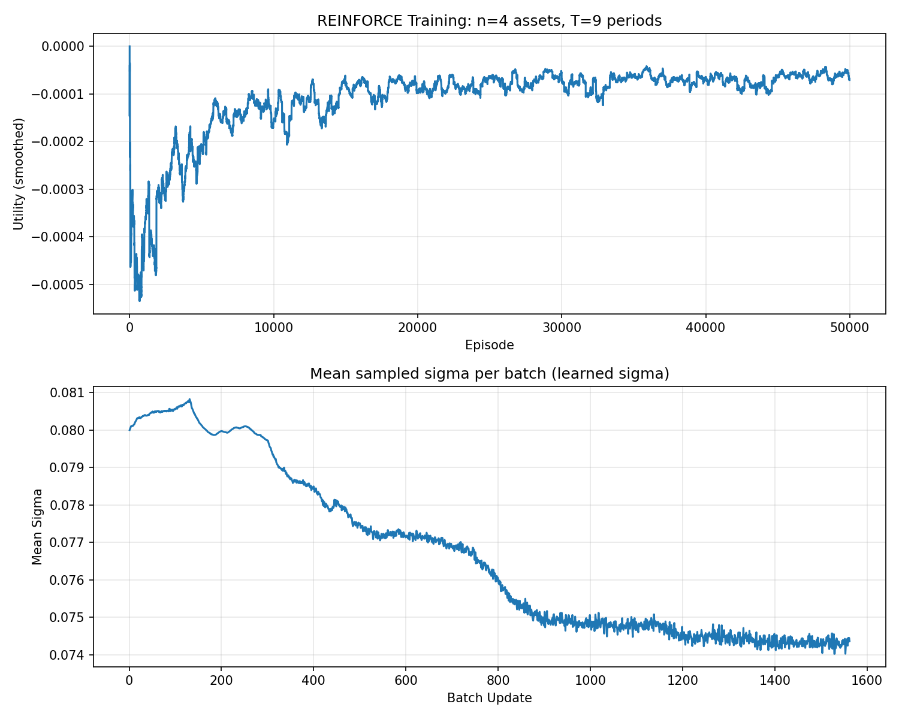

# MSBD5021 Assignment 1: Multi-Asset Allocation with REINFORCE

This project implements a REINFORCE (Monte-Carlo Policy Gradient) algorithm for discrete-time multi-asset portfolio allocation, extending Section 8.4 of *Foundations of Reinforcement Learning with Applications in Finance* (Rao & Jelvis) to **n risky assets + cash** with a **10% rebalancing constraint** and **CARA utility**.

## Problem Formulation

### MDP Definition

| Component | Description |
|-----------|-------------|
| **State** | $(t/T,\; W_t,\; p_0,\; p_1,\; \dots,\; p_n)$ — normalized time, wealth, and current portfolio proportions |
| **Action** | $(\Delta p_1,\; \dots,\; \Delta p_n)$ — adjustments to risky asset proportions |
| **Constraint** | $\|\Delta p_k\| \le 0.1$ for all $k$ (including cash) |
| **Transition** | $W_{t+1} = W_t \sum_k p'_k (1 + Y_k)$, where $Y_k \sim \mathcal{N}(\mu_k, \sigma_k^2)$ for risky assets and $Y_0 = r$ for cash |
| **Reward** | $0$ for $t < T$; $\;U(W_T) = -\frac{1}{a} e^{-a W_T}$ at terminal |

### Key Features

- **n risky assets** ($2 < n < 5$) plus a riskless cash asset
- **CARA utility** with constant absolute risk aversion coefficient $a$
- **10% max portfolio adjustment** per period — no analytical solution, requiring RL
- Works for **any time horizon** $T < 10$

## Algorithm Overview

The core algorithm is a mini-batch REINFORCE with a running mean baseline ($\beta = 0.99$):

- Policy: neural network outputs action mean $\mu$; sigma ($\sigma$) can be:
  - **learned** (state-dependent, final algorithm)
  - **manual decay** (linearly decayed, for ablation)
  - **fixed** (constant, for ablation)
- Network: 2-layer MLP (64 hidden units, ReLU activations, Tanh output scaled by `max_adjustment`)
- Optimizer: Adam ($\text{lr} = 3 \times 10^{-4}$) with cosine annealing LR schedule
- Mini-batch: 32 trajectories per gradient update
- Discount factor: $\gamma = 1$ (only terminal reward)

### REINFORCE Algorithm

This project uses the REINFORCE (Monte-Carlo Policy Gradient) algorithm for policy optimization. REINFORCE is an on-policy policy gradient method that estimates the policy gradient by sampling complete trajectories and using the episodic return as an unbiased gradient estimator, directly optimizing a parameterized policy.

Since this problem only has a non-zero reward at the terminal time step \(t = T\) (the CARA utility) and the discount factor is \(\gamma = 1\), the return of each trajectory is simply the terminal reward itself:

$$
G = R_T = -\frac{1}{a} e^{-a W_T}
$$

The policy gradient theorem gives the following gradient estimate with respect to the policy parameters \(\theta\):

$$
\nabla_\theta J(\theta) = \mathbb{E}_{\pi_\theta} \left[ \sum_{t=0}^{T-1} \nabla_\theta \log \pi_\theta(a_t | s_t) \cdot G \right]
$$

To reduce variance, a baseline \(b\) is introduced, replacing \(G\) with the advantage \(G - b\). This does not change the expected gradient but significantly reduces variance. The baseline is maintained as an exponential moving average:

$$
b \leftarrow 0.99 \cdot b + 0.01 \cdot \bar{G}_{\text{batch}}
$$

where \(\bar{G}_{\text{batch}}\) is the mean return over the current mini-batch.

In practice, each gradient update samples a mini-batch of \(B = 32\) complete trajectories. The loss function is:

$$
\mathcal{L}(\theta) = -\frac{1}{B} \sum_{i=1}^{B} \sum_{t=0}^{T-1} \log \pi_\theta(a_t^{(i)} | s_t^{(i)}) \cdot (G^{(i)} - b)
$$

The Adam optimizer (learning rate \(\text{lr} = 3 \times 10^{-4}\)) is used to perform gradient descent on \(\mathcal{L}\), combined with a Cosine Annealing learning rate scheduler that smoothly decays the learning rate from its initial value down to \(0.01 \times \text{lr}\).

### Policy Network Architecture

The policy network \(\pi_\theta\) maps the current state \(s \in \mathbb{R}^d\) (where \(d = 2 + n + 1\), comprising the normalized time \(t/T\), current wealth \(W_t\), and all asset proportions \(p_0, p_1, \dots, p_n\)) to the parameters of a multivariate Gaussian distribution: the action mean \(\mu \in \mathbb{R}^n\) and standard deviation \(\sigma \in \mathbb{R}^n\).

The feature extraction backbone is a two-layer MLP with hidden dimension 64:

$$
h_1 = \mathrm{ReLU}(W_1 s + b_1), \quad h_2 = \mathrm{ReLU}(W_2 h_1 + b_2)
$$

The action mean is produced by a linear layer followed by a Tanh activation, scaled by the maximum adjustment magnitude \(\delta_{\max}\):

$$
\mu = \tanh(W_\mu h_2 + b_\mu) \times \delta_{\max}
$$

Since Tanh outputs values in \((-1, 1)\), each component of \(\mu\) is inherently bounded within \((-\delta_{\max},\; \delta_{\max})\), providing a soft constraint that ensures the network's mean output does not exceed the allowed maximum adjustment.

For the action standard deviation \(\sigma\), the project supports three strategies. The final algorithm uses **learned sigma** (network-adaptive), produced by a separate linear head and mapped through a sigmoid into a predefined range \([\sigma_{\min},\; \sigma_{\max}]\):

$$
\sigma = \sigma_{\min} + (\sigma_{\max} - \sigma_{\min}) \cdot \text{sigmoid}(W_\sigma h_2 + b_\sigma)
$$

The final policy distribution is a multivariate Gaussian with diagonal covariance:

$$
\pi_\theta(a | s) = \mathcal{N}(a;\; \mu,\; \mathrm{diag}(\sigma^2))
$$

During training, actions are sampled from this distribution \(a \sim \pi_\theta(\cdot|s)\) to enable exploration. During evaluation, the mean \(a = \mu\) is used directly as a deterministic policy.

### Constraint Implementation

The problem requires that portfolio adjustments at each time step satisfy \(|\Delta p_k| \le \delta_{\max} = 0.1\) for all assets \(k\), including cash. Since the action space only outputs adjustments for the \(n\) risky assets \((\Delta p_1, \dots, \Delta p_n)\), the cash adjustment is implicitly determined by the budget constraint as \(\Delta p_0 = -\sum_{k=1}^n \Delta p_k\). The constraints are enforced in three steps within the environment.

**Step 1: Clip risky asset adjustments.** The raw action sampled from the policy network is clipped component-wise to the allowed range:

$$
\Delta p_k \leftarrow \mathrm{clip}(\Delta p_k,\; -\delta_{\max},\; \delta_{\max}), \quad k = 1, \dots, n
$$

**Step 2: Rescale to satisfy the cash constraint.** The implied cash adjustment \(\Delta p_0 = -\sum_{k=1}^n \Delta p_k\) is computed. If \(|\Delta p_0| > \delta_{\max}\), all risky asset adjustments are proportionally rescaled:

$$
\Delta p_k \leftarrow \Delta p_k \times \frac{\delta_{\max}}{|\Delta p_0|}, \quad k = 1, \dots, n
$$

This ensures that after rescaling, \(|\Delta p_0| = \delta_{\max}\), while all risky asset adjustments also remain within \(\delta_{\max}\) (since the scaling factor is less than 1).

**Step 3: Non-negativity and renormalization.** The updated proportion vector \(p' = p + \Delta p\) is truncated to be non-negative and renormalized to sum to 1:

$$
p'_k \leftarrow \max(p'_k,\; 0), \quad p'_k \leftarrow \frac{p'_k}{\sum_j p'_j}
$$

Through these three steps, the environment enforces all constraints when executing actions, allowing the policy network to output freely in continuous action space while a projection mechanism on the environment side maps actions into the feasible region.


## Policy Sigma Strategies: Comparison


| Sigma Type | Description | Advantages | Limitations / Use Cases |
|------------|-------------|------------|------------------------|
| **learn**  | Policy network outputs state-dependent $\sigma$; adaptively balances exploration and exploitation during training | Best performance, dynamically adjusts exploration/exploitation, suitable for real deployment | Slightly higher training complexity, may require more tuning |
| **manual** | $\sigma$ decays linearly with training progress | Simple to implement, suitable for initial experiments and ablation | Cannot adapt exploration to state, may be suboptimal in later training |
| **fixed**  | $\sigma$ remains constant throughout training | Simplest, good for sanity checks and as a baseline | Rigid exploration/exploitation trade-off, limited performance |

This project uses **learn** as the final algorithm. **manual** and **fixed** are provided for ablation and baseline comparison only.

## Project Structure

```
Assignment1_v3/
├── asset_alloc.py        # Main implementation
├── configs/              # JSON config files for all (n, T) combinations
│   ├── n3_T1.json        #   n=3 risky assets, T=1..9
│   ├── ...
│   └── n4_T9.json
├── scripts/
│   ├── run_all_config.sh         # Run all (n, T) configs to show generality
│   └── compare_sigma_types.sh    # Compare fixed/manual/learn sigma on a single config
├── figs/            
│   └── curve_n4_T9.png  # Case study example
├── results/             # Output training curves
├── pyproject.toml       # Project dependencies
└── README.md
```

## Setup

Requires [uv](https://docs.astral.sh/uv/) and Python ≥ 3.14.

```bash
cd Assignment1_v3
uv sync
```

## Usage

### Run a single configuration

```bash
uv run python asset_alloc.py configs/n4_T9.json -o results/curve_n4_T9.png
```


### Run all (n, T) configurations

Demonstrate that the algorithm generalizes to any valid $n$ and $T$:

```bash
bash scripts/run_all_config.sh
```

This runs all combinations of $n \in \{3, 4\}$ and $T \in \{1, 2, \dots, 9\}$.

### Compare sigma strategies (ablation)

Compare the three sigma strategies (fixed/manual/learn):

```bash
bash scripts/compare_sigma_types.sh
```


## Config File Format

Each JSON config specifies the problem parameters:

```json
{
  "n_risky": 4,
  "means": [0.15, 0.05, 0.08, 0.20],
  "variances": [0.04, 0.09, 0.01, 0.16],
  "r": 0.07,
  "a": 5.0,
  "T": 5,
  "init_wealth": 1.0,
  "init_proportions": [0.1, 0.1, 0.6, 0.1, 0.1],
  "max_adjustment": 0.1,
  "num_episodes": 50000,
  "batch_size": 32,
  "print_every": 4000
}
```

| Parameter | Description |
|-----------|-------------|
| `n_risky` | Number of risky assets |
| `means` | Expected returns $\mu_k$ for each risky asset |
| `variances` | Return variances $\sigma_k^2$ for each risky asset |
| `r` | Riskless interest rate |
| `a` | CARA risk aversion coefficient |
| `T` | Investment time horizon (number of periods) |
| `init_wealth` | Initial wealth $W_0$ |
| `init_proportions` | Initial portfolio proportions $[p_0, p_1, \dots, p_n]$ (sum = 1) |
| `max_adjustment` | Maximum allowed proportion change per period |
| `num_episodes` | Number of training episodes |
| `batch_size` | Trajectories per gradient update (default: 32) |
| `print_every` | Print training progress every N episodes |

## Parameter Design

The configs are designed to demonstrate meaningful strategy learning:

**n=3 assets:**

| Asset | $\mu_k$ | $\sigma_k^2$ | Characteristic |
|-------|---------|-------------|----------------|
| Asset1 | 0.15 | 0.04 | High return, low risk |
| Asset2 | 0.05 | 0.09 | $\mu < r$, high risk — should avoid |
| Asset3 | 0.20 | 0.16 | Highest return, very high risk |

**n=4 assets:** adds Asset3 ($\mu=0.08 \approx r$, $\sigma^2=0.01$, cash-like)

**Key design choices:**
- $a = 5.0$ (high risk aversion) — agent must balance return vs. risk, not just maximize return
- Initial proportions **deliberately suboptimal** (60% in a poor asset) — agent must learn to rebalance under the 10% constraint
- Some assets have $\mu_k < r$ — agent must learn to **avoid** bad assets

## Output

The program prints:

1. **Training progress** — average utility every `print_every` episodes
2. **Evaluation table** — mean portfolio proportions and actions at each time step (deterministic policy)
3. **Terminal statistics** — average terminal wealth and utility
4. **Training figure** — saved as a PNG file, showing both the smoothed utility curve and the mean sampled policy sigma for each batch update


## Case Study: Learned Policy Sigma

As a case study, we use `configs/n4_T9.json`. The training curve is shown below:



The lower panel of the figure shows the mean policy sigma ($\sigma$) during training. Initially, sigma is large, encouraging exploration. As training progresses, sigma automatically decreases, shifting the policy from exploration to exploitation and eventually converging to a better solution. This demonstrates the adaptivity and practical advantage of the learn strategy.